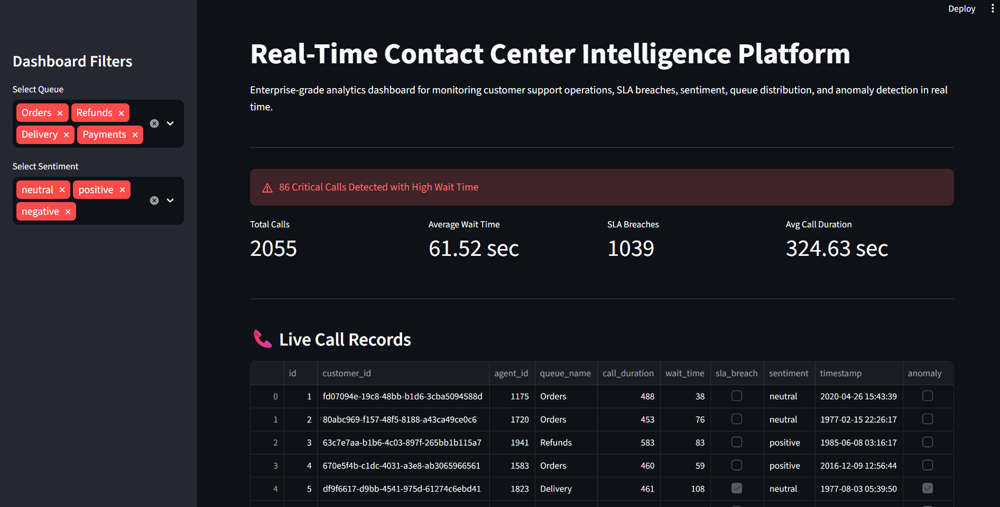
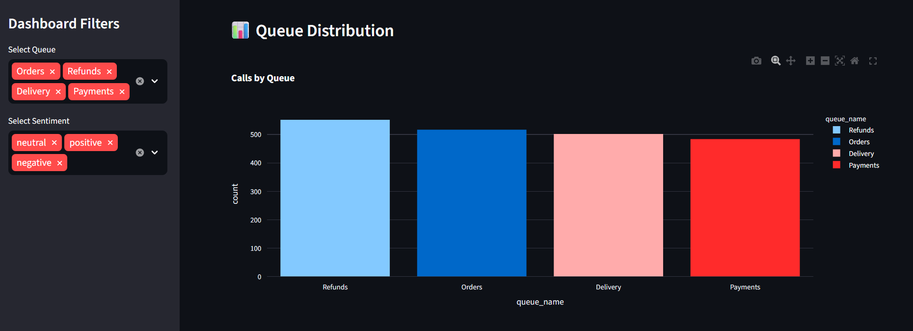
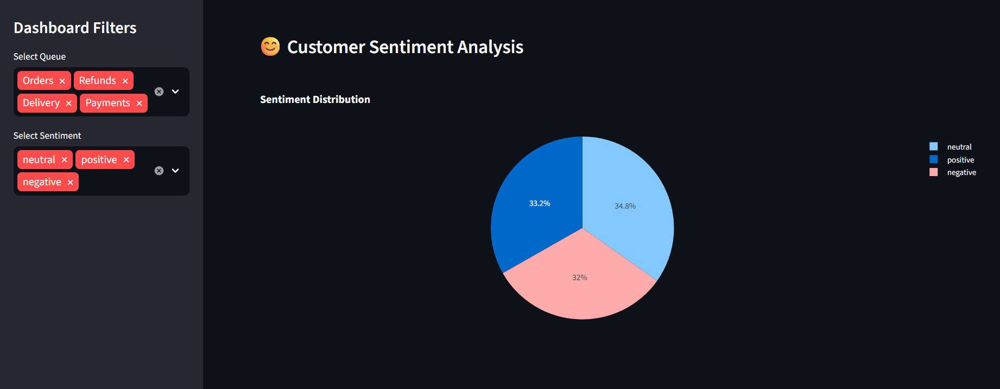
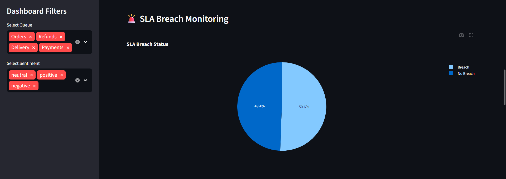
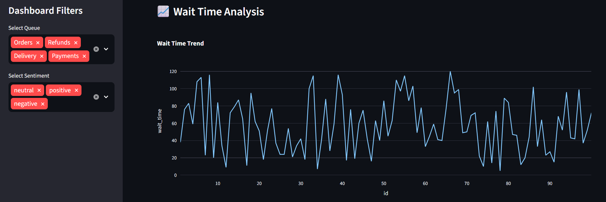
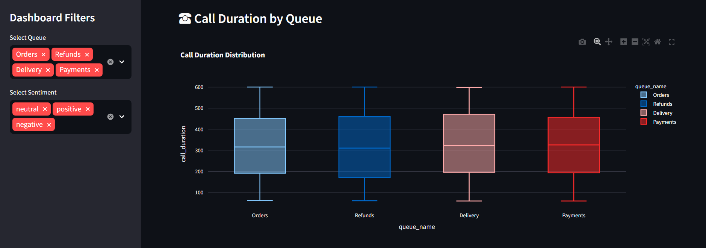
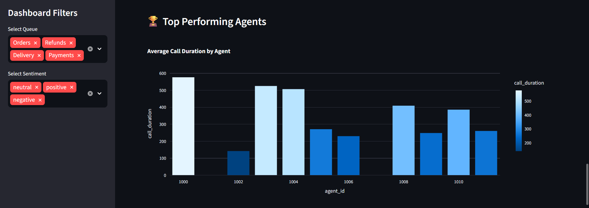
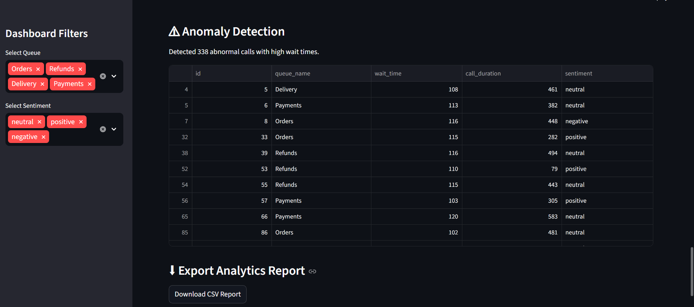

# Real-Time Contact Center Intelligence Platform

Enterprise-grade real-time streaming analytics and operational intelligence platform built using Apache Kafka, PostgreSQL, Streamlit, Docker, and Python.

This project simulates modern cloud-based contact center analytics systems similar to enterprise operational intelligence platforms used in large-scale customer support environments.

---

# Project Overview

This platform demonstrates a complete end-to-end streaming analytics pipeline where customer interaction records are continuously generated, processed, stored, analyzed, and visualized in real time.

The system focuses on operational intelligence for contact center environments including:

* Real-time KPI monitoring
* SLA breach tracking
* Queue performance analytics
* Customer sentiment analysis
* Wait time monitoring
* Agent performance tracking
* AI-driven anomaly detection
* Interactive BI dashboard reporting

The architecture follows modern event-driven data engineering principles commonly used in enterprise cloud analytics systems.

---

# High-Level Architecture

```text
                ┌────────────────────────────┐
                │ Call Data Generator        │
                │ Customer Interaction Data  │
                └─────────────┬──────────────┘
                              │
                              ▼
                ┌────────────────────────────┐
                │ Kafka Producer             │
                │ Real-Time Streaming        │
                └─────────────┬──────────────┘
                              │
                              ▼
                ┌────────────────────────────┐
                │ Kafka Topic                │
                │ call_records_topic         │
                └─────────────┬──────────────┘
                              │
                              ▼
                ┌────────────────────────────┐
                │ Analytics Consumer         │
                │ Event Processing ETL       │
                └─────────────┬──────────────┘
                              │
                              ▼
                ┌────────────────────────────┐
                │ PostgreSQL Warehouse       │
                │ Analytics Storage          │
                └─────────────┬──────────────┘
                              │
                              ▼
                ┌────────────────────────────┐
                │ Streamlit Dashboard        │
                │ Live Operational Insights  │
                └────────────────────────────┘
```

---

# Tech Stack

| Layer            | Technology   |
| ---------------- | ------------ |
| Language         | Python       |
| Streaming        | Apache Kafka |
| Database         | PostgreSQL   |
| Dashboard        | Streamlit    |
| Visualization    | Plotly       |
| ORM              | SQLAlchemy   |
| Containerization | Docker       |
| Version Control  | Git & GitHub |

---

# Features

* Real-Time Streaming Analytics
* SLA Monitoring
* Queue Performance Tracking
* Customer Sentiment Analysis
* Wait Time Monitoring
* Agent Performance Analytics
* Interactive BI Dashboard
* AI-Based Anomaly Detection
* Exportable Analytics Reports

---
# Screenshot
















---

# Project Structure

```text
amazon-connect-analytics/
│
├── alerts/
├── architecture/
├── dashboards/
│   └── app.py
├── data_generator/
│   └── generate_calls.py
├── docker/
├── etl/
│   └── consumer.py
├── kafka/
│   └── producer.py
├── screenshots/
├── warehouse/
│   └── data/
├── docker-compose.yml
├── requirements.txt
└── README.md
```

---

# Scalability Considerations

* Kafka topics can be partitioned for scalability
* Consumers can scale horizontally
* PostgreSQL supports operational analytics workloads
* Streamlit dashboards can be containerized independently
* Architecture supports future cloud migration

---

# Future Enhancements

* AWS Cloud Deployment
* Kubernetes Orchestration
* CI/CD Integration
* AI Predictive Analytics
* Alerting & Notification Systems
* Real-Time Monitoring Pipelines

---

# Learning Outcomes

This project demonstrates practical understanding of:

* Event-driven architecture
* Real-time streaming systems
* Kafka-based pipelines
* Operational analytics engineering
* Interactive BI dashboarding
* Dockerized environments
* PostgreSQL warehousing
* Distributed systems concepts


# Author

Harini M

Data Engineering | Distributed Streaming Systems | Cloud Analytics
